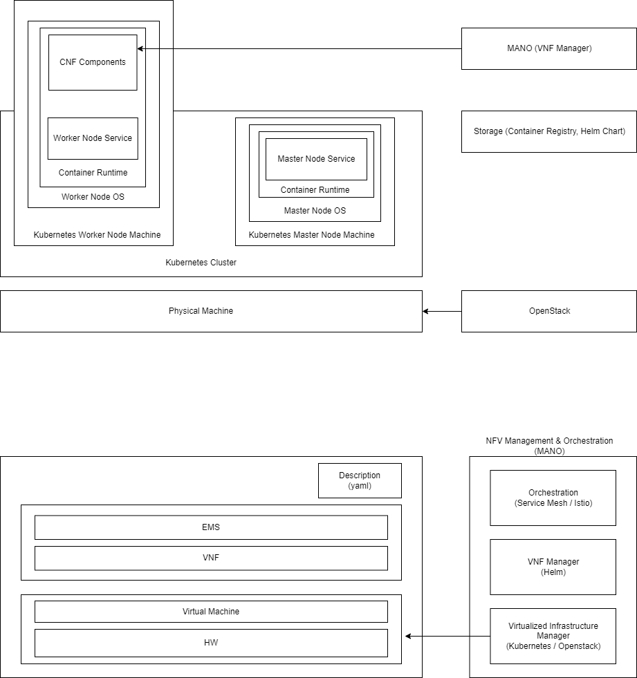

## 1. 설계 원칙 4가지를 설명하시오
## 2. voting app example
```yaml
apiVersion: apps/v1
kind: Deployment
metadata:
  labels:
    app: redis
  name: redis
  namespace: vote
spec:
  replicas: 1
  selector:
    matchLabels:
      app: redis
  template:
    metadata:
      labels:
        app: redis
    spec:
      containers:
      - image: redis:alpine
        name: redis
        ports:
        - containerPort: 6379
          name: redis
        volumeMounts:
        - mountPath: /data
          name: redis-data
      volumes:
      - name: redis-data
        emptyDir: {}
```

```yaml
apiVersion: v1
kind: Service
metadata:
  labels:
    app: redis
  name: redis
  namespace: vote
spec:
  type: ClusterIP
  ports:
  - name: "redis-service"
    port: 6379
    targetPort: 6379
  selector:
    app: redis
```

1. Declarative rather than


기말시험 : 전체 범위


principle 1. Delarative

원하는 상태를 서술한다

각각의 오브젝트, 리소스들이 뭐가 있고 무엇을 하는것인가
그것을 서술하는데 yaml 포맷으로 서술한다 이런것들 공부

principle 2. No hidden internal APIs

API 서버가 명령을 내리는 방식이 아니라 각 오브젝트가 API 서버를 보고 능동적으로 처리

Kube API Data

Secret : Sensitive 정보 like password, certificates
ConfigMap : Configuration 정보 like startup parameter
DownwardAPI : Pod의 정보 like name, namespace, uid

principle 3. Supporting Legacy Applications

API를 access하는게 아니라 별도의 remote volume을 사용하도록 한다

principle 4. Workload Portability

pvc를 사용


voting app deployment file을 살펴봐라

Volume 설명

**개념들 + yaml 파일 꼭 확인**
**yaml 필드를 채워라, 이 필드가 뭐냐**

Telco 1문제

5G : NFV Architecture 부분 그림으로

mano가 무엇인가, 구조
이 그림

5G는 볼필요 없고
NFV-Cloud Native : Kubernetes Reference Architecture scope 구조

모든 오브젝트들의 의미, yaml
NFV Reference Model, Kubernetes Reference Model


========================================================================================

## 1. Daemonset
- 용도 : 클러스터 전체에 포드를 띄울 때 사용
- ```spec.selector```는 ```spec.template.metadata.labels``` 와 동일해야 한다
```yaml
apiVersion: apps/v1
kind: DaemonSet
metadata:
  name: fluentd-elasticsearch
  namespace: kube-system
  labels:
    k8s-app: fluentd-logging
spec:
  selector:
    matchLabels:
      name: fluentd-elasticsearch
  template:
    metadata:
      labels:
        name: fluentd-elasticsearch
    spec:
      tolerations:    # 마스터 노드에서 실행시킬 때 사용
      - key: node-role.kubernetes.io/master
        operator: Exists
        effect: NoSchedule
      containers:
      - name: fluentd-elasticsearch
        image: quay.io/fluentd_elasticsearch/fluentd:v2.5.2
        resources:
          limits:
            memory: 200Mi
          requests:
            cpu: 100m
            memory: 200Mi
        volumeMounts:
        - name: varlog
          mountPath: /var/log
        - name: varlibdockercontainers
          mountPath: /var/lib/docker/containers
          readOnly: true
      terminationGracePeriodSeconds: 30
      volumes:
      - name: varlog
        hostPath:
          path: /var/log
      - name: varlibdockercontainers
        hostPath:
          path: /var/lib/docker/containers
```

## 2. StatefulSet
(https://m.blog.naver.com/PostView.naver?isHttpsRedirect=true&blogId=isc0304&logNo=221885403537)
- 용도 : 포드를 영구적으로 유지하고 싶을 경우 사용
- 포드 네트워크 아이디를 유지하기 위해 헤드리스 서비스 필요
- 안정적인 스토리지 제공을 위해 PVC 필요
```yaml
apiVersion: v1
kind: Service
metadata:
  name: nginx
  labels:
    app: nginx
spec:
  ports:
    - port: 80
      name: web
  clusterIP: None
  selector:
    app: nginx
---
apiVersion: apps/v1
kind: StatefulSet
metadata:
  name: web
spec:
  selector:
    matchLabels:
      app: nginx # has to match .spec.template.metadata.labels
  serviceName: "nginx"      # 연결하고자 하는 헤드레스 서비스 지정
  replicas: 3
  template:
    metadata:
      labels:
        app: nginx # has to match .spec.selector.matchLabels
    spec:
      terminationGracePeriodSeconds: 10
      containers:
        - name: nginx
          image: k8s.gcr.io/nginx-slim:0.8
          ports:
            - containerPort: 80
              name: web
          volumeMounts:
            - name: www
              mountPath: /usr/share/nginx/html
  volumeClaimTemplates:   # 안정적인 스토리지 제공을 위해 PVC를 작성
    - metadata:
        name: www
      spec:
        accessModes: [ "ReadWriteOnce" ]
        storageClassName: "my-storage-class"
        resources:
          requests:
            storage: 1Gi
```

## 3. Job, CronJob
- 용도 : 하나 이상의 Pod를 생성하고 성공적으로 종료될때 까지 재시도하기 위해 사용
- restartPolicy : onFailure(실패시 자기 자신을 재시작), Never(실패시 새로 생성)
- backoffLimit : 실패시 재시도 횟수
```yaml
apiVersion: batch/v1
kind: Job
metadata:
  name: pi
spec:
  completions: 3     # job 성공 기준
    parallelism: 3    # 한번에 실행시키는 pod 개수
  template:
    spec:
      containers:
      - name: pi
        image: perl
        command: ["perl",  "-Mbignum=bpi", "-wle", "print bpi(2000)"]
      restartPolicy: Never    # 실패시 재시작 여부
  backoffLimit: 4             # 실패시 재시작 시도 횟수
```
- 용도 : 지정된 일정에 따라 주기적으로 Job 실행
- schedule : 분 시 일 월 연도 순
```yaml
apiVersion: batch/v1
kind: CronJob
metadata:
  name: hello
spec:
  schedule: "*/1 * * * *"
  jobTemplate:
    spec:
      template:
        spec:
          containers:
          - name: hello
            image: busybox
            imagePullPolicy: IfNotPresent     # 로컬에 이미지가 없는 경우
            command:
            - /bin/sh
            - -c
            - date; echo Hello from the Kubernetes cluster
          restartPolicy: OnFailure
```

## 4. emptyDir, hostPath
- 용도 : Pod가 사라지면 볼륨도 사라지는 임시 볼륨
```yaml
apiVersion: v1
kind: Pod
metadata:
  name: test-pd
spec:
  containers:
  - image: k8s.gcr.io/test-webserver
    name: test-container
    volumeMounts:
    - mountPath: /cache
      name: cache-volume
  volumes:
  - name: cache-volume
    emptyDir: {}
```
- 용도 : 호스트 노드의 디스크에 마운트
```yaml
apiVersion: v1
kind: Pod
metadata:
  name: test-pd
spec:
  containers:
  - image: k8s.gcr.io/test-webserver
    name: test-container
    volumeMounts:
    - mountPath: /test-pd
      name: test-volume
  volumes:
  - name: test-volume
    hostPath:
      # directory location on host
      path: /data
      # this field is optional
      type: Directory
```
## 5. configMap
용도 : 컨테이너에서 필요한 환경설정 내용을 컨테이너와 분리하여 제공하기 위한 기능 (key-value 형식)
```yaml
apiVersion: v1
kind: ConfigMap
metadata:
  name: game-demo
data:
  # 속성과 비슷한 키; 각 키는 간단한 값으로 매핑됨
  player_initial_lives: "3"
  ui_properties_file_name: "user-interface.properties"

  # 파일과 비슷한 키
  game.properties: |
    enemy.types=aliens,monsters
    player.maximum-lives=5
  user-interface.properties: |
    color.good=purple
    color.bad=yellow
    allow.textmode=true
```

```yaml
apiVersion: v1
kind: Pod
metadata:
  name: configmap-demo-pod
spec:
  containers:
    - name: demo
      image: alpine
      command: ["sleep", "3600"]
      env:
        # 환경 변수 정의
        - name: PLAYER_INITIAL_LIVES # 참고로 여기서는 컨피그맵의 키 이름과
                                     # 대소문자가 다르다.
          valueFrom:
            configMapKeyRef:
              name: game-demo           # 이 값의 컨피그맵.
              key: player_initial_lives # 가져올 키.
        - name: UI_PROPERTIES_FILE_NAME
          valueFrom:
            configMapKeyRef:
              name: game-demo
              key: ui_properties_file_name
      volumeMounts:
      - name: config
        mountPath: "/config"
        readOnly: true
  volumes:
    # 파드 레벨에서 볼륨을 설정한 다음, 해당 파드 내의 컨테이너에 마운트한다.
    - name: config
      configMap:
        # 마운트하려는 컨피그맵의 이름을 제공한다.
        name: game-demo
        # 컨피그맵에서 파일로 생성할 키 배열
        items:
        - key: "game.properties"
          path: "game.properties"
        - key: "user-interface.properties"
          path: "user-interface.properties"
```
## 6. Secret
용도 : 민감한 정보를 노출하지 않기 위해
```yaml
apiVersion: v1
kind: Secret
metadata:
  name: secret-basic-auth
type: kubernetes.io/basic-auth
stringData:
  username: admin
  password: t0p-Secret
```

```yaml
apiVersion: v1
kind: Pod
metadata:
  name: mypod
spec:
  containers:
  - name: mypod
    image: redis
    volumeMounts:
    - name: foo
      mountPath: "/etc/foo"
      readOnly: true
  volumes:
  - name: foo
    secret:
      secretName: mysecret
```
## 7. DownwardAPI
용도 : Pod 생성 후 가지는 속성들을 환경변수나 볼륨에 제공
```yaml
apiVersion: v1
kind: Pod
metadata:
  name: downward-env
spec:
  containers:
  - name: main
    image: busybox
    command: ["sleep", "99999"]
    resources:
      requests:
        cpu: 15m
        memory: 100Ki
      limits:
        cpu: 100m
        memory: 20Mi
    env:
    - name: POD_NAME
      valueFrom:
        fieldRef:
          fieldPath: metadata.name
    - name: POD_NAMESPACE
      valueFrom:
        fieldRef:
          fieldPath: metadata.namespace
    - name: POD_IP
      valueFrom:
        fieldRef:
          fieldPath: status.podIP
    - name: NODE_NAME
      valueFrom:
        fieldRef:
          fieldPath: spec.nodeName
    - name: SERVICE_ACCOUNT
      valueFrom:
        fieldRef:
          fieldPath: spec.serviceAccountName
    - name: CONTAINER_CPU_REQUEST_MILLICORES
      valueFrom:
        resourceFieldRef:
          resource: requests.cpu
          divisor: 1m
    - name: CONTAINER_MEMORY_LIMIT_KIBIBYTES
      valueFrom:
        resourceFieldRef:
          resource: limits.memory
          divisor: 1Ki
```

```yaml
apiVersion: v1
kind: Pod
metadata:
  name: downward-volume
  labels:
    foo: bar
  annotations:
    key1: value1
    key2: |
      multi
      line
      value
spec:
  containers:
  - name: main
    image: busybox
    command: ["sleep", "9999999"]
    resources:
      requests:
        cpu: 15m
        memory: 100Ki
      limits:
        cpu: 100m
        memory: 40Mi
    volumeMounts:
    - name: downward
      mountPath: /etc/downward
  volumes:
  - name: downward
    downwardAPI:
      items:
      - path: "podName"
        fieldRef:
          fieldPath: metadata.name
      - path: "podNamespace"
        fieldRef:
          fieldPath: metadata.namespace
      - path: "labels"
        fieldRef:
          fieldPath: metadata.labels
      - path: "annotations"
        fieldRef:
          fieldPath: metadata.annotations
      - path: "containerCpuRequestMilliCores"
        resourceFieldRef:
          containerName: main
          resource: requests.cpu
          divisor: 1m
      - path: "containerMemoryLimitBytes"
        resourceFieldRef:
          containerName: main
          resource: limits.memory
          divisor: 1
```

## 8. Horizontal Pod Autoscaler
용도 : 리소스 사용량을 관찰하여 파드 개수를 자동으로 스케일링
```yaml
apiVersion: autoscailing/v2beta1
kind: HorizontalPodAutoscaler
metadata:
  name: helloworld-boot-hpa
  labels:
    app: helloworld-boot-hpa
spec:
  minReplicas: 1
  maxReplicas: 10

  # Scale할 조건
  metrics:
    - resource:
        name: cpu
        targetAverageUtilization: 5
      type: Resource

  # Scale할 ReplicaSet 설정
  scaleTargetRef:
    apiVersion: apps/v1
    kind: Deployment
    name: helloworld-boot-deployment-hpa
```

## 9. Vertical Pod Autoscaler
용도 : 리소스 사용량을 관찰하여 리소스 자원을 자동으로 스케일링
```yaml
apiVersion: "autoscaling.k8s.io/v1beta2"
kind: VerticalPodAutoscaler
metadata:
  name: hamster-vpa
spec:
  targetRef:
    apiVersion: "apps/v1"
    kind: Deployment
    name: hamster
  resourcePolicy:
    containerPolicies:
      - containerName: '*'
        minAllowed:
          cpu: 100m
          memory: 50Mi
        maxAllowed:
          cpu: 1
          memory: 500Mi
        controlledResources: ["cpu", "memory"]
```


## 10. PodDisruptionBudget
용도 : Pod 중단 허용 범위를 설정
```yaml
apiVersion: policy/v1beta1
kind: PodDisruptionBudget
metadata:
  name: zk-pdb
spec:
  minAvailable: 2
  selector:
    matchLabels:
      app: zookeeper
```


==============================================================================================
NFV : Network Functions Virtualization
기존 네트워크 장비들은 특수한 하드웨어와 그 위에 동작하는 소프트웨어로 구성
범용 서버에 소프트웨어를 운영하는 형태로 변화(벤더 종속성 탈피)
소프트웨어를 가상화하여 돌리는 것

VNF, CNF

NFV 참조모델
MANO : NFV Management and Orchestration

인터페이스 이름을 외울 필요는 없다

머신 위에 가상화 해서 가상 머신 위에 VNF가 돌고 있다
서비스, VNF, Description : yaml 파일, 스펙을 보고 인프라 안에 만들면 자동으로 생기는 것
VNF Manager
  Description을 읽어서 생성하는 것
  Virtual Machine (OpenStack) 시절에는 명령을 내려 실제로 만들어야 했다
  여러 Pod를 동시에 만드는 패키지화 된 것들 like helm
Orchestration : 연결하는 것, like service mesh, istio
Virtualized Infra Manager : Openstack or Kubernetes


Kubernetes Version

VNF 대신 CNF
Virtual Machine이 아니라 Virtual Machine 위에 Kubernetes Worker Node로 동작
내부에는 Kubelet, kube-proxy, ...

### NFV Reference Model, Kubernetes Reference Model의 구조를 설명하시오

MANO : NFV Management and Orchestration

Orchestration : Service Mesh, Istio와 같이 연결하는 기능
VNF Manager : Description을 읽어 Pod를 생성한다 like helm
Virtualized Infra Manager : Openstack, Kubernetes 와 같이 가상화 장치를 Manage 한다




